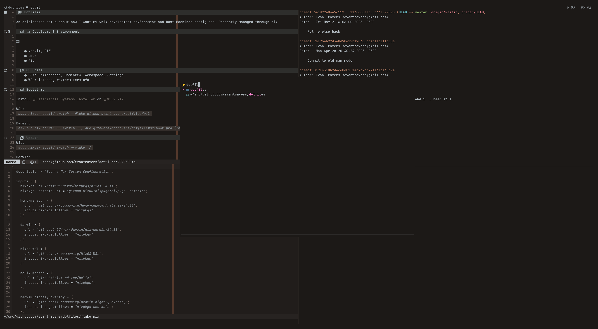

# Dotfiles

An opinionated setup about how I want my *nix development environment and host machines configured. Presently managed through nix.

## Development Environment

- Neovim, BTW
- tmux
- fish

## OS Hosts
- OSX: Hammerspoon, Homebrew, Aerospace, Settings
- WSL: interop, wezterm.terminfo

## Bootstrap

Install [Determinite Systems Installer](https://github.com/DeterminateSystems/nix-installer) or [WSL2 Nix](https://github.com/nix-community/NixOS-WSL)

WSL:
`sudo nixos-rebuild switch --flake github:evantravers/dotfiles#wsl`

Darwin:
`nix run nix-darwin -- switch --flake github:evantravers/dotfiles#macbook-pro-[intel m1]`

## Update
WSL:
`sudo nixos-rebuild switch --flake ./`

Darwin:
`darwin-rebuild switch --flake ./`

## References
- Mainly copying mitchellm's incredible work, especially mksystem.nix
