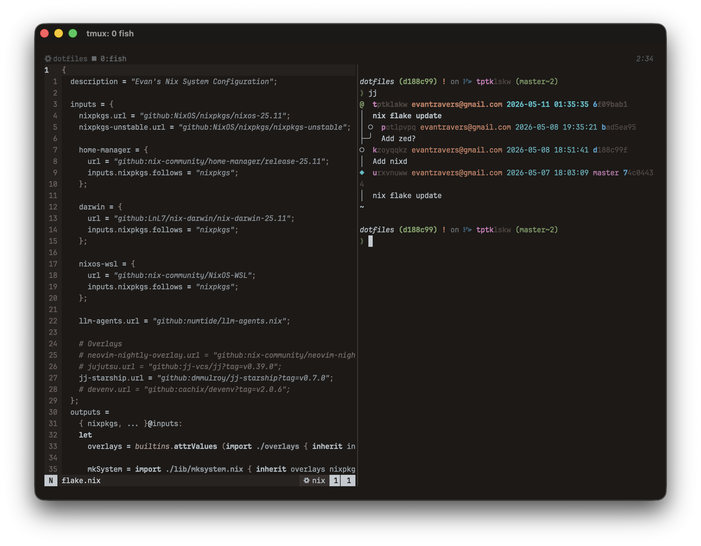

# Dotfiles

An opinionated setup about how I want my *nix development environment and host machines configured. Presently managed through nix.

## Development Environment

- Neovim, BTW
- tmux
- fish
- jujutsu

## OS Hosts

- OSX:
  - Hammerspoon
  - Kanata
  - Homebrew
  - Settings
- WSL:
  - interop
  - wezterm.terminfo
  - 1Password passthru

## Bootstrap

Install [Determinate Systems Installer](https://github.com/DeterminateSystems/nix-installer) or [WSL2 Nix](https://github.com/nix-community/NixOS-WSL)

WSL:
`sudo nixos-rebuild switch --flake github:evantravers/dotfiles#wsl`

Darwin:
- Install [homebrew](https://brew.sh/)
- `sudo nix run nix-darwin -- switch --flake github:evantravers/dotfiles[#macbook-pro]`

Use 1Password to configure SSH Agent for host

## Update

WSL:
`sudo nixos-rebuild switch --flake ./`
OR
`nh os switch ./`

Darwin:
`darwin-rebuild switch --flake ./`
OR
`nh darwin switch ./`

## References
- Mainly copying mitchellm's incredible work, especially mksystem.nix
